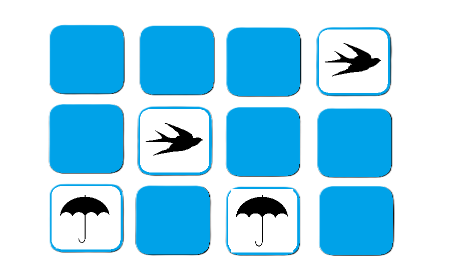

# Funkcionális specifikáció
## 1. Jelenlegi helyzet leírása

Jelenleg nincsen az inteneten elegendő olyan letölthető, és könnyen elérhető, illetve kezelhető memóriajáték, amit internet elérés nélkül lehetne használni, és emellett a játékos tudná tesztelni a memóriáját és reakció idejét is.

## 2. Vágyálomrendszer leírása

A cél egy olyan kártyafordítós memóriajáték elkészítése, ami egyszerű és átlátható. Amikor a felhasználó elkezdi a játékot és rákattint kettő kártyára, akkor azok átfordulnak és ha nem párok akkor egy bizonyos idő után mindkettő visszafordul, ellenkező esetben ekkor felfordítva maradnak és ha az összes párt felfordította a megadott esélyek alatt akkor kapunk egy értesítést, hogy nyert a felhasználó és hogy hány lépésből sikerült megtalálnia az összes párt. A játék C# Form-ban lesz leprogramozva.

## 3. Jelenlegi üzleti folyamatok modellje

Jelenleg, ha a felhasználó játszani szeretne egy memória tesztelő játékkal akkor az interneten kell rákeresnie és olyan oldalakkal találja szembe magát amely tele van sok nem releváns reklámokkal illetve kötelező az internetkapcsolat is. Az ilyen típusú játékoknak a minősége is változó és sokáig is eltarthat, ha az ember egy minőségi játékot akar találni. Ezek nagyrészét nem lehet letölteni, ezért kénytelenek vagyunk a böngészőnkből használni ami a felhasználóknak sok plusz lépést jelent.

## 4. Igényelt üzleti folyamatok modellje

A felhasználó, ha letöltötte a játékot akkor bármikor meg tudja azt nyitni és addig játszik vele akadálytalanul ameddig akar, és ha végzett a játékkal akkor egyszerűen képes bezárni a játékot.

## 5. Követelménylista

| Id | Modul | Név | Leírás |
| :---: | --- | --- | --- |
| K1 | Játék | Kártyák megjelenítése | A játékos lát egy lefelé fordított kártyarácsot a képernyőn. |
| K2 | Játék | Kártyák felfordítása | A játékos két kártyát fordíthat fel egyszerre, ha rákattint a kártyákra. |
| K3 | Játék | Pár megtalálása | Ha a két felfordított kártya azonos, azok felfordulva maradnak. |
| K4 | Játék | Kártyák visszafordítása | Ha a két kártya nem egyezik, egy idő után visszafordulnak. |

## 6. Használati esetek

A felhasználó egy egyszerű, könnyen átlátható alkalmazás keretein belül tesztelheti memóriáját.

## 7. Megfeleltetés, hogyan fedik le a használati eseteket a követelményeket

A felhasználó a kártyákra kattintva keres párokat, ha nem egyeznek meg akkor azok visszafordulnak, ha megegyeznek akkor úgy maradnak és kereshetjük a következő párt. Ha mindegyik párt megtaláltuk akkor a játék kiírja hogy hány lépésből teljesítettük.

## 8. Képernyőtervek

## 9. Forgatókönyvek

Az alkalmazást elindítva megjelennek a kártyák amelyeket felfordigatva párosítani kell a velük azonos kártyával, majd a játék befejeztével megtekinthetjük a próbálkozások számát is.

## 10. Funkció - követelmény megfeleltetése

K1: Az alkalmazás elindításával megjelennek a képernyőn a kártyák. K2: A kártyák közül választhatunk hogy melyiket akarjuk felfordítani. 
K3: Sikeres párosítás során a kártyák felfordítva maradnak. K4: Ha nem egyeznek a kártyák akkor azok visszafordulnak.

## 11 Fogalomszótár
| Fogalom | Leírás |
| :---: | --- |
| C# | programozási nyelv, az játék ebben lesz megírva |
